# Database ERD — generated from `server/schema.sql` (2026-10-07)

**Goal:** the missing Excel row #10 diagram, grounded byte-for-byte in `server/schema.sql:1-247` (19 tables).
**Falsifiable check:** every `CREATE TABLE` name in schema.sql appears below; `python` check in ledger. Relations marked `(kolom)` are real SQL columns; relations marked `(payload)` live inside the JSON `payload` column and are enforced by `server/validation/entities.php`, not FK constraints (no FKs in schema — document it, don't hide it).

```mermaid
erDiagram
    cabang ||--o{ users : "cabang_id (kolom)"
    cabang ||--o{ sekolah : "cabang_id (kolom)"
    cabang ||--o{ trainer : "cabang_id (kolom)"
    cabang ||--o{ siswa : "cabang_id (kolom)"
    cabang ||--o{ raport : "cabang_id (kolom)"
    cabang ||--o{ eksternal : "cabang_id (kolom)"
    cabang ||--o{ invoices : "cabang_id (kolom)"
    cabang ||--o{ absensi : "cabang_id (kolom)"
    cabang ||--o{ absensi_pengajar : "cabang_id (kolom)"
    cabang ||--o{ spp_payments : "cabang_id (kolom)"
    cabang ||--o{ honor_payments : "cabang_id (kolom)"
    cabang ||--o{ photo_uploads : "cabang_id (kolom)"
    cabang ||--o{ service_tokens : "cabang_id (kolom)"
    trainer ||--o{ users : "trainer_id (kolom)"
    users ||--o{ audit_log : "actor_user_id (kolom)"
    users ||--o{ photo_uploads : "owner_user_id (kolom)"
    users ||--o{ backups : "created_by (kolom)"
    users ||--o{ service_tokens : "user_id (kolom)"
    absensi_pengajar ||--o{ absensi_pengajar : "correction_of (kolom)"
    honor_payments ||--o{ honor_payments : "correction_of (kolom)"
    sekolah ||--o{ siswa : "sekolahId (payload)"
    sekolah ||--o{ raport : "via siswa.sekolahId (payload)"
    sekolah ||--o{ absensi_pengajar : "sekolahId (payload)"
    trainer ||--o{ absensi_pengajar : "trainerId (payload)"
    trainer ||--o{ honor_payments : "trainerId (payload)"
    siswa ||--o{ spp_payments : "siswaId (payload)"
    invoices ||--o{ spp_payments : "payload.invoiceId (kolom? tidak — payload)"
    users ||--o{ login_attempts : "key_hash(username, bukan FK)"
    sync_log ||--o{ absensi : "record_id (log, bukan FK)"

    cabang {
        varchar id PK
        varchar kode UK
        varchar nama
        int version
        json payload
    }
    users {
        varchar id PK
        varchar username UK
        varchar display_name
        varchar password_hash
        enum role
        varchar cabang_id
        varchar trainer_id
    }
    sekolah {
        varchar id PK
        varchar cabang_id
        int version
        json payload
    }
    trainer {
        varchar id PK
        varchar cabang_id
        int version
        json payload
    }
    siswa {
        varchar id PK
        varchar cabang_id
        int version
        json payload
    }
    raport {
        varchar id PK
        varchar cabang_id
        int version
        json payload
    }
    eksternal {
        varchar id PK
        varchar cabang_id
        int version
        json payload
    }
    invoices {
        varchar id PK
        varchar cabang_id
        int version
        json payload
    }
    absensi {
        varchar id PK
        varchar cabang_id
        int version
        json payload
    }
    absensi_pengajar {
        varchar id PK
        varchar cabang_id
        varchar correction_of
        int version
        json payload
    }
    spp_payments {
        varchar id PK
        varchar cabang_id
        int version
        json payload
    }
    honor_payments {
        varchar id PK
        varchar cabang_id
        varchar correction_of
        int version
        json payload
    }
    audit_log {
        bigint id PK
        varchar actor_user_id
        varchar cabang_id
        varchar event_type
    }
    service_tokens {
        varchar id PK
        varchar prefix UK
        char token_hash UK
        varchar user_id
        enum role
    }
    photo_uploads {
        varchar id PK
        varchar cabang_id
        varchar owner_user_id
        varchar storage_path
    }
    backups {
        varchar id PK
        char checksum
        varchar location
        varchar created_by
    }
```

## Notes (load-bearing, don't simplify away)

1. **No FK constraints.** All cross-table links are application-enforced (`entities.php` + `authorize.php`). The diagram is the contract the validators implement.
2. **`payload` JSON carries business fields** (sekolahId, trainerId, siswaId, invoiceId, penugasanPengajar[], jadwalList). Column-level ER only shows routing keys.
3. **Backup omits** `absensi_pengajar`, `photo_uploads` bytes, `users`, `audit_log` (`backupRestore.php:12-34`) — restore drops them by design (G-P1.2 Boundary).
4. **Ledgers** (`absensi_pengajar`, `honor_payments`, `spp_payments`) are INSERT-only with `correction_of` chains, never UPDATE (`bootstrap.php:225-249`).
5. `login_attempts`, `schema_migrations`, `migrations`, `sync_log`, `settings` are infra/ops tables with no domain relations (settings is global, superadmin-only).
