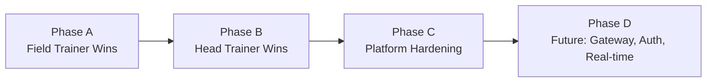

# Afterschola Admin Dashboard — Scope Expansion Plan

**This document is the new working roadmap.** It consolidates all field-trainer and head-trainer feedback from the August 2026 review sessions.  
All decisions from `IMPLEMENTATION_PLAN.md` remain in force unless explicitly revised below.  
If the two documents disagree, **this file wins**.

**Prepared by:** Kilo (AI Assistant)  
**Date:** 2026-08-10  
**Status:** Ready for team execution

---

## Table of Contents

1. [Consolidated Gap Analysis](#part-1--consolidated-gap-analysis)
2. [Phased Development Sequence](#part-2--phased-development-sequence)
3. [Financial Reports & Field Refinements](#part-3--financial-reports--field-refinements)
4. [Eight-Item Final Disposition](#part-4--eight-item-final-disposition)
5. [Revised Decisions (Plan Constraints Lifted)](#part-5--revised-decisions-plan-constraints-lifted)
6. [Privilege Matrix (Superadmin / Admin Cabang / Trainer)](#part-6--privilege-matrix-superadmin--admin-cabang--trainer)
7. [File Assignment Map](#part-7--file-assignment-map)
8. [What Survives vs. What's Next](#part-8--what-survives-vs-whats-next)

---

## Part 1 — Consolidated Gap Analysis

### Original M0–M4 Assessment

The base application is **admin-complete but trainer-naive**. It successfully delivered:
- Cash-basis accounting (D1) with labeled memo rows
- Append-only honor payment ledger (D3)
- Academic-year engine Jul→Jun (D4)
- Sparse `sppLunas` maps, factory functions, and ID-join discipline

### Gaps Confirmed by Field & Head Trainer

| # | Gap | Severity | Client Impact |
|---|-----|----------|---------------|
| 1 | **No role separation** — everyone sees full admin panel | Critical | Field trainer is shown financial data they shouldn't see; risk of accidental edits |
| 2 | **Attendance lacks real-world fields** — no assistant, no documentation, no notes | Critical | Head trainer manually reconciles CSV because app can't capture what's needed |
| 3 | **Financial reporting too rigid** — no PDF invoice/slip, no flexible ranges, no executive view | High | Leadership still exports to CSV and uses old accounting software |
| 4 | **No SPP payment ledger** — `sppLunas` is a boolean toggle with no custody trail | High | Can't track *who* collected money or *when* it was remitted |
| 5 | **No trial student mechanism** — binary active/inactive status | Medium | New students are either fully billed immediately or invisible |
| 6 | **No multi-branch (cabang) structure** — assumes single entity | Medium | Future expansion blocked; schema not tenant-aware |
| 7 | **No attendance verification workflow** — digital records float free of paper reality | Medium | Printing/paper is still the de-facto source of truth. Solved by **tiered verification**: photo of paper at capture, save-time count prompt, trainer weekly self-certification (attribution), Head review by exception queue + random sample only (no review-everything bottleneck), paper retained 1 academic year as dispute backstop. No OCR, no models |
| 8 | **No MTD/YTD comparison** — single-month view only | Low | Trend analysis requires manual CSV work |

---

## Part 2 — Phased Development Sequence

> **Philosophy:** Phase A makes the field team actually use the app. Phase B makes leadership trust the numbers. Phase C makes the platform scalable. Do not skip A to reach C.



### Phase A — Field Trainer Wins (Priority 1)

**Goal:** Make the trainer prefer this app over paper/CSV.

- **A1.** Role-based UI split (Admin vs Trainer view, soft-login)
- **A2.** Attendance upgrade: assistant dropdown, photo documentation (2 slots), `catatan` field
- **A3.** Quick-session flow ("Semua Hadir" button + tap exceptions)
- **A4.** Trainer-only views: view-only student list, own attendance history, and a **working "Rekap Saya" landing page** (today's schedule + pending status + own honor summary), not a placeholder
- **A5.** Tiered verification: save-time sanity prompt + trainer weekly self-certification + exception-filtered review queue (Head reviews anomalies and a random sample, not every record); paper retention policy printed in-app as dispute backstop

### Phase B — Head Trainer / Finance Wins (Priority 2)

**Goal:** Eliminate the need for the old accounting software.

- **B1.** SPP payment ledger (`sppPayments` with `diterimaOleh`, `sudahDisetor`, photo proof)
- **B2.** Slip Honor (PDF/print per payment, signature lines)
- **B3.** Invoice per School (numbered, status: draft → terbit → lunas)
- **B4.** Flexible reporting: MTD/YTD, semester presets, custom range
- **B5.** Aging Tunggakan (buckets: Bulan ini / 1 bln / 2+ bln)
- **B6.** Executive Summary card (big Laba/Rugi + red flags)

### Phase C — Platform & Multi-Branch (Priority 3)

**Goal:** Support growth to multiple branches with central oversight.

- **C1.** `cabang` entity + `cabangId` on schools
- **C2.** Branch-prefixed IDs (`trn-PST-…`, `sw-BDG-…`) — *irreversible, do now*
- **C3.** Server-first storage prep (PHP API client, IndexedDB outbox)
- **C4.** Photos outside localStorage (IndexedDB or server)
- **C5.** Unit tests for `finance.js`, `tunggakan.js`, `constants.js`, `backup.js`
- **C6.** PWA shell (installable, offline-capable)

---

## Part 3 — Financial Reports & Field Refinements

### CTO / Head Trainer Financial Reports (Approved)

| Report | Description | Effort | Dependencies |
|--------|-------------|--------|--------------|
| **Slip Honor** | Printable pay slip per `honorPayments` entry with signature lines | Low | Existing ledger + print CSS |
| **Invoice per School** | Monthly billing document with numbering and status | Medium | `sppLunas` + school data |
| **Aging Tunggakan** | Bucketed debt report (30/60/90+ days) | Low | `tunggakan.js` + elapsedPeriods |
| **MTD/YTD Comparison** | Side-by-side current vs. previous period vs. same period last year | Medium | `financialData()` function |
| **Executive Summary** | One-card view: Laba/Rugi large, collection %, auto red flags | Medium | Finance engine + thresholds |
| **SPP Payment Ledger** | Append-only `sppPayments` mirroring honorPayments pattern | High | Schema change + new UI |

### Field Trainer UX Refinements (Approved)

- **Offline-save confirmation** — timestamp badge after each successful save
- **Two photo slots** — "Foto Kehadiran" (payroll proof) vs "Foto Kegiatan" (service proof)
- **"What's pending today"** — indicator showing scheduled schools not yet attended
- **Roster drift warning** — alert when new students appear not covered by past attendance
- **View-only student list** — searchable, shows SPP status, no edit buttons
- **Proof-visible own history** — trainer sees `asisten`, `dokumentasi`, and `catatan` on their own attendance rows BEFORE self-certifying (the capture fields must not vanish after save)

---

## Part 4 — Eight-Item Final Disposition

| # | Item | Decision | Priority | Notes |
|---|------|----------|----------|-------|
| 1 | Absensi verification | ✅ Build (tiered) | High | Photo + sanity prompt + self-certification + exception queue; no OCR, no review-everything |
| 2 | MTD/YTD comparison | ✅ Build | High | Finance-focused; limit metrics |
| 3 | Flow documentation | ✅ Build | High | Zero code; write day-in-life scripts |
| 4 | One-week trial system | ✅ Build | High | **Blocked on billing rule** (see below) |
| 5 | Simple executive view | ✅ Build | High | Card on Overview |
| 6 | Branch admin + super admin | 🟡 Schema now, feature later | Medium | Server-first required |
| 7 | Flexible pricing per branch | 🟡 `sppOverride` now, honor matrix later | Medium | YAGNI on matrix until real case |
| 8 | Attendance notes | ✅ Build | Low | Single `catatan` field |

### Item 4 — Trial Student Billing Rule (Client Decision Required)

**Question to answer:** If a trial student converts to active, is the trial week back-billed or free?

- **Option A:** Free trial week — conversion writes no backdated `sppLunas` entries
- **Option B:** Back-billed — conversion writes `sppLunas` for the trial period's month

**Impact:** This changes whether conversion writes one or multiple ledger entries. Everything else is mechanical.

---

## Part 5 — Revised Decisions (Plan Constraints Lifted)

These original constraints from `IMPLEMENTATION_PLAN.md` are **revised** because hosting is now confirmed (cPanel + own domain) and multi-branch is officially in scope.

| Original Decision | Revised Decision | Reason |
|-------------------|------------------|--------|
| **D5/D7:** LocalStorage only, auth later | **Server-first storage** | cPanel confirmed; multi-branch needs shared state *now*; child PII + photos make per-browser storage actively bad |
| **Absensi ID:** Composite `${tanggal}_${sekolahId}_${trainerId}` | **Opaque ID** (`abs-…`) | Prevents silent overwrite on same-day multiple sessions; date corrections don't rewrite identity |
| **Photos in localStorage** | **Never in localStorage** | 5-10MB quota died Friday of week 1; use IndexedDB or server upload |
| **Manual gates only** | **Unit tests mandatory** | Pure functions in `finance.js`, `tunggakan.js`, `constants.js`, `backup.js` must have test coverage before new features touch them |
| **No PWA** | **PWA recommended** | Trainers on phones in schoolyards need installable, offline-capable app |
| **`dataRev` + reload hack** | **Reactive store** | Replace with Zustand or context + `useSyncExternalStore` during storage migration |

### Still Valid (Kept Unchanged)

- D1: Cash-basis accounting with labeled memo rows
- D3: Append-only ledger principle
- D4: Academic-year engine (Jul→Jun)
- Factory functions + sparse maps
- Design system preservation (R5)
- Print-friendly reports

---

## Part 6 — Privilege Matrix (Superadmin / Admin Cabang / Trainer)

> **Design principle:** A role may only write what it is answerable for. The branch is answerable for *operations*; the head office is answerable for *money*.

| Scope | Superadmin (Pusat) | Admin Cabang | Trainer |
|-------|-------------------|--------------|---------|
| **Cabang management** | ✅ Full | ❌ No access | ❌ No access |
| **Data Sekolah** | ✅ Write pusat; 🔍 Read all branches | 🔍 Read own branch | 🔍 Read assigned schools |
| **Honor tarif & contract terms** | ✅ Full | ❌ Not visible | ❌ Not visible |
| **Data Trainer** | ✅ Full everywhere | 🟡 Propose only | 🔍 Read own record |
| **Data Siswa** | ✅ Full (audit) | ✅ Full own branch | 🔍 Read-only view |
| **Absensi entry** | 🔍 Read + ✅ Verify | ✅ Write own branch | ✅ Write own sessions |
| **Absensi verification** | ✅ Verify all | ✅ Verify own (before pusat lock) | ❌ No access |
| **Payment collection** (`sppPayments`) | ✅ Full all | ✅ Record own; ✅ flag `sudahDisetor` | ❌ No access |
| **Honor payments** (`honorPayments`) | ✅ Full — only role that pays | 🔍 Read own trainers | ❌ No access |
| **Invoicing & slips** | ✅ Generate all | 🔍 View/print own branch | ❌ No access |
| **Laporan Keuangan** | ✅ Everything | 🟡 Own branch redacted | ❌ No access |
| **Tunggakan & WA** | ✅ All | ✅ Own branch (template from pusat) | ❌ No access |
| **Backup** | ✅ Any/all | ✅ Own branch only | ❌ No access |
| **Restore** | ✅ All (with confirm) | ❌ Never | ❌ Never |
| **Global settings** | ✅ | ❌ | ❌ |

**Legend:** ✅ Full write · 🟡 Constrained/derived · 🔍 Read-only · ❌ No access

**Trainers** are a fourth sub-branch role with strictly narrower permissions than Admin Cabang.

---

## Part 7 — File Assignment Map

```
src/
  features/
    auth/                    — NEW: soft-login, role selector (Phase A1)
      RolePicker.jsx
      TrainerDashboard.jsx
    attendance/
      AttendanceForm.jsx     — MODIFY: assistant dropdown, photos, catatan, quick-session
      RiwayatAbsensi.jsx     — MODIFY: add verification flag, filter "belum dicek"
      TrainerHistory.jsx     — NEW: trainer-only own history view
      QuickSession.jsx       — NEW: "Semua Hadir" shortcut flow
    students/
      StudentList.jsx        — MODIFY: view-only mode for trainer role
      TrialBadge.jsx         — NEW: trial countdown indicator
    payments/
      PaymentTable.jsx       — MODIFY: add Slip Honor button per entry
      HonorHistory.jsx       — MODIFY: add slip print trigger
      SppPaymentModal.jsx    — NEW: collect SPP with metode + photo
    reports/
      FinanceReport.jsx      — MODIFY: add MTD/YTD, range presets
      SlipHonor.jsx          — NEW: printable pay slip template
      InvoiceTemplate.jsx    — NEW: printable invoice template
      AgingReport.jsx        — NEW: tunggakan buckets
      ExecutiveSummary.jsx   — NEW: big Laba/Rugi + red flags card
    admin/
      BranchManager.jsx      — NEW: cabang CRUD (superadmin only)
  lib/
    store.js                 — MODIFY: add role context, cabang filtering
    finance.js               — MODIFY: add `sppPayments` aggregation, aging calc
    constants.js             — MODIFY: add `cabang` prefix logic, trial constants
    backup.js                — MODIFY: include new entities in backup shape
    sppPayments.js           — NEW: SPP ledger mirror of honorPayments pattern
  server/
    api/                     — NEW: PHP endpoints (Phase C)
      absensi.php
      sppPayments.php
      sync.php
```

---

## Part 8 — What Survives vs. What's Next

### What Survives from Original Plan (Solid Foundation)

| Component | Status | Why It Survives |
|-----------|--------|-----------------|
| `finance.js` cash-basis engine | ✅ Keep | Correct for 2-flow business |
| `honorPayments` ledger | ✅ Keep | Append-only pattern proven |
| Academic-year engine | ✅ Keep | Pure, tested, invisible |
| Factory functions + sparse maps | ✅ Keep | Prevents schema drift |
| Design system / styling | ✅ Keep | Visual consistency is real |
| Backup format v2+ | ✅ Keep | Already the sync wire format |

### What Must Be Built Next (In Order)

1. **Phase A** — Field Trainer improvements (role split + attendance upgrade)
2. **Phase B** — Financial reporting suite (slips, invoices, aging, executive view)
3. **Phase C** — Platform hardening (branches, server storage, testing, PWA)

### Immediate Next Steps (Team Action Items)

- [ ] Complete detailed flow documentation for Trainer and Head Trainer — Product integration; existing visual/handoff gate
- [ ] Finalize billing rule for trial students (back-billed or free?) — Product/business approver; M5.4 decision gate
- [ ] Begin Phase A implementation — Product integration; M1.1–M1.4

### Deferred and Superseded Disposition

This table is synchronized with `PRODUCTION_PLAN.md` §12. Each item has one owner and one resolving boundary; these entries are not open implementation scope for Phase A–C unless the linked milestone explicitly starts.

| Item | Disposition | Owner | Resolving milestone / boundary |
|---|---|---|---|
| Self-service email password reset | Deferred | Platform/auth | Post-release P1: transactional email infrastructure |
| Real-time updates / WebSocket infrastructure | Deferred | Platform/auth | Post-release P2: realtime infrastructure |
| Soft-delete / trash | Deferred | Product integration + Data/release | Post-release P3: retention and recovery decision |
| Flexible branch-specific honor matrix | Deferred pending business case | Product/business approver | Post-release P4: approved business case |
| Prototype cleanup and handoff | Deferred until visual parity | Product integration | Existing visual gate, before release handoff |
| Trial conversion billing rule | Open business decision | Product/business approver | M5.4 decision gate, before trial release |
| cPanel hosting access and capability confirmation | Blocked prerequisite | Data/release | D7.1, then D7.2–D8.3 |
| JWT, signed-header auth, per-branch `.htaccess` protection | Explicit non-goal | Platform/auth | Excluded from first release; revisit only through a new architecture decision |
| Firebase, `afterschola_v3_*`, prototype credentials, and Node production backend | Explicit non-goal | Platform/auth + Data/release | Excluded from first release and migration source |

---

## Appendix — Quick Reference Tables

### Entity Changes Summary

| Entity | New Fields | New Entity? | Phase |
|--------|-----------|-------------|-------|
| `absensi` | `asistenId`, `asistenNama`, `dokumentasi[]`, `catatan`, `statusVerifikasi`, `konfirmasiTrainer`, `sesiKe` | No | A |
| `siswa` | `status: 'Trial'|'Aktif'|'Berhenti'`, `trialMulai`, `sppOverride` | No | A |
| `sekolah` | `cabangId` | No | C |
| — | `sppPayments` ledger | Yes | B |
| — | `cabang` entity | Yes | C |
| — | `invoice` | Yes | B |

### Storage Decision Tree

```
Is it a JSON record? → localStorage (v5_* keys with branch prefix)
Is it a photo >100KB? → IndexedDB (idb-keyval)
Is it shared/multi-branch? → Server MySQL via PHP API
Is it a document (invoice/slip)? → Generated client-side, printed to PDF
```

### The One Irreversible Decision

> **Branch-prefixed IDs must be decided before the first multi-branch deployment.**  
> Once live data exists with timestamp-based IDs, retrofitting requires a manual migration. Do it in Phase C1 even if branches don't launch until months later.

---

**End of Scope Expansion Plan**
